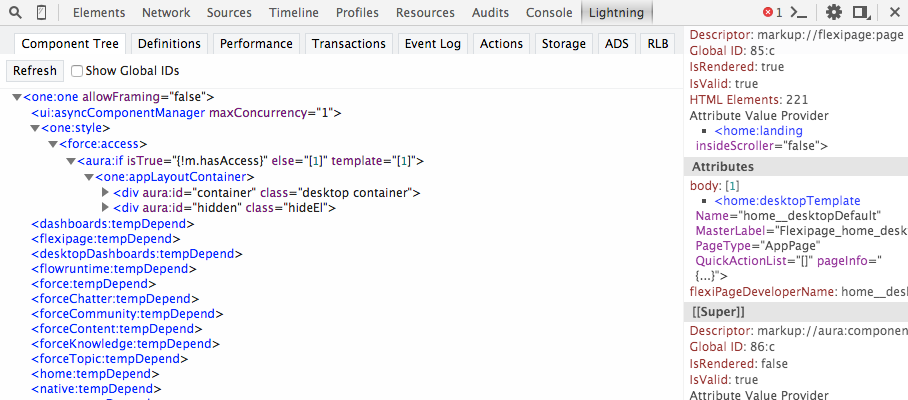

# Doc for the Lightning Components Inspector Chrome plugin

The Lightning Components Inspector allows you to view and navigate the component tree for a component, inspect attributes of components, and investigate the component performance. 

# Installation
TODO: ask Skip where to point people for installation. Available on Chrome Web Store?

# Usage

1. Navigate to a Lightning app. For this doc, we're using the doc reference app at /auradocs/reference.app
2. Launch the Chrome Dev Tools (More tools > Developer tools).

You should see a Lightning tab in the dev tools.

There are a number of of sub tabs available to inspect different aspects of your app.

TODO: brief one-liner explanation for each tab
- Component Tree
- Performance
- Transactions
- Event Log
- Actions
- Storage
- ADS
- Definitions
- RLB

## Component Tree Tab
This tab shows the component markup.

### Collapse or Expand Markup
You can expand or collapse the markup by clicking on the triangles at the start of each line. By default, the tree shows four levels of nested markup.

### Refresh the Data
The component tree is expensive to serialize, and doesn't respond to component updates. You need to manually update the tree when necessary by scrolling to the top of the panel and clicking the *Refresh* button.

### See More Details for a Node
Double click a node to bring up a sidebar with more details for that selected node.

The sidebar contains the following information:

- *HTML Elements*  The count of HTML elements for the component (including children components).
- *body* The body of your overall component is complex, but this shows you the body of your component, and the bodies of all the components you extended. The resulting body is the composition of those bodies.
- *Supers* Shows you all the super components and their value providers. A component shares its attributes among all its supers so each level doesn't have its own set of attributes. There is just one attribute value at the concrete level, but each level of extension has its own body.

### Get a Reference to a Component in the Console

Double clicking on a component in the Component Tree or details sidebar generates a reference to that component in the console in the variable $auraTemp.

## Performance Tab

This tab shows a flame graph of the creation time for your Lightning components. Longer and deeper portions of the graph are where you should look for potential performance bottlenecks.

TODO: image

### Record Performance Data
Press the Record button to gather performance data. 

TODO: click around while gathering data?

Press the Record button again to stop gathering performance data.

TODO: does the flame graph show now.

TODO: When i tried this with http://documentation.auraframework.org/auradocs#reference , i got a popup: Error clearing marks on inspected window.

TODO: what does Collect Marks do? Does it show the flame graph while you continue to record?

### See More Performance Details for a Component
Hover over a component in the flame graph to see more detailed information about that component in the bottom-left corner.

TODO: image

### Narrow the Timeline
Drag on the timeline to select a period of time to focus on.

## Transactions Tab

TODO: need more details on what this shows and how to populate the panel. I couldn't see any data using Record.

TODO: add a good screenshot that is not internal specific.

## Event Log Tab

TODO: need more details on what this shows and how to populate the panel. I couldn't see any data using Record.

TODO: add image

## Storage Tab

TODO: The storage service is an open source feature and not available for Lightning components. Should this tab be exposed? If so, what should we say about "actions" and "ComponentDefRegistry"?

## ADS Tab

TODO: is this relevant for Lightning components? If so, what should we say about it?

## RLB Tab

TODO: I see the message:  "Error": "No force:recordLayoutBroker components yet created". What is force:recordLayoutBroker and what do users need to know about it?

