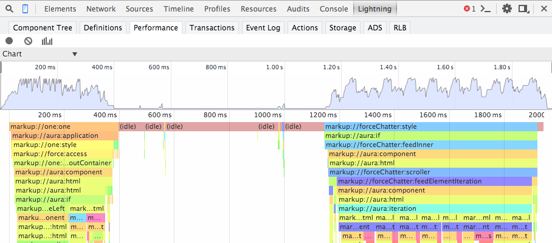
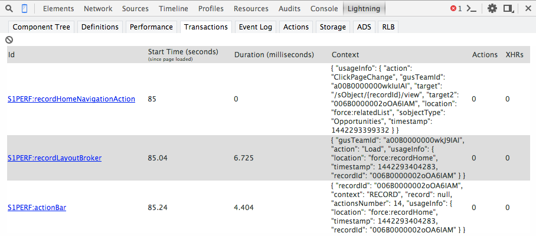

# Lightning Components Inspector
## * Google Chrome DevTools Extension *   

***

The Lightning Components Inspector allows you to view and navigate the component tree for a component, inspect attributes of components, and investigate the component performance. 

# Terms of Use

This tool is provided "as-is" for early-access use. It carries no warranties, guaranties, or other obligations, written or implied.

# Prerequisites

1. Lightning Components proficiency.
2. Experience with debugging web applications, including JavasScript, HTML, and CSS.
3. Familiarity with the Chrome DevTools, and the ability to install and use Chrome Extensions.

# Installation

1. From Google Chrome, navigate to the [Lightning Components Inspector](https://www.sfdc.co/inspector) on the Chrome Web Store.
2. Click the *Add to Chrome* button

# Support

Please post any questions or feedback to the [Lightning Components Inspector Chatter Group](https://org62.my.salesforce.com/_ui/core/chatter/groups/GroupProfilePage?g=0F930000000kAWn). This software is early access, please do not contact Salesforce support!

# Usage

1. Navigate to a Lightning app. For this doc, we're using the Salesforce1/Lightning Experience app at /one/one.app
2. Launch the Chrome Dev Tools (More tools > Developer tools).

You should see a Lightning tab in the dev tools.

There are a number of of sub tabs available to inspect different aspects of your app.

TODO: brief one-liner explanation for each tab or link to each section below
- Component Tree
- Definitions
- Performance
- Transactions
- Event Log
- Actions
- Storage
- ADS
- RLB

## Component Tree Tab
This tab shows the component markup including the tree of nested components.

### Collapse or Expand Markup
You can expand or collapse the markup by clicking on the triangles at the start of each line. By default, the tree shows four levels of nested markup.

### Refresh the Data
The component tree is expensive to serialize, and doesn't respond to component updates. You need to manually update the tree when necessary by scrolling to the top of the panel and clicking the *Refresh* button.

### See More Details for a Node
Double click a node to bring up a sidebar with more details for that selected node.

The sidebar contains the following information:

- *HTML Elements*  The count of HTML elements for the component (including children components).
- *body* The body of your overall component is complex, but this shows you the body of your component, and the bodies of all the components you extended. The resulting body is the composition of those bodies.
- *Supers* Shows you all the super components and their value providers. A component shares its attributes among all its supers so each level doesn't have its own set of attributes. There is just one attribute value at the concrete level, but each level of extension has its own body.

### Get a Reference to a Component in the Console

Double clicking on a component in the Component Tree or details sidebar generates a reference to that component in the console in the variable $auraTemp.

## Definitions Tab

This tab shows the list of definitions loaded on the page. Each definition describes metadata for an element, such as a component, event, or controller.

## Performance Tab

This tab shows a flame graph of the creation time for your Lightning components. Longer and deeper portions of the graph are where you should look for potential performance bottlenecks.

### Record Performance Data
The *Clear*, *Record*, and *Show current collected* buttons can be used to gather performance data. Use these buttons to capture specific user actions, or collections of user actions.

1. Press the *Record* button to start gathering performance data.
2. Press the *Record* button again to stop gathering performance data.
3. Press the *Show current collected* button to display the performance data.

### See More Performance Details for a Component
Hover over a component in the flame graph to see more detailed information about that component in the bottom-left corner. This information includes the component complexity and timing information, and may be used to diagnose performance issues.

### Narrow the Timeline
Drag on the timeline to select a period of time to focus on.

## Transactions Tab
Some apps delivered by Salesforce include transaction markers that enable you to see fine-grained metrics for actions within those transactions. You can't create your own transactions at this time.

The list of transactions includes counts of actions and XHRs (server-side requests) executed while the transaction was open. The list includes actions/XHRs fired by other events or handlers while the transaction was open. An XHR can include a batch of more than one server-side actions. 

### See More Transaction Details
Click the ID of a transaction to see more data in the Console.

## Event Log Tab

This tab shows all the events fired. 

### Record Events
The *Toggle recording* and *Clear* buttons can be used to gather event data. Use these buttons to capture specific user actions, or collections of user actions. The *Filter* input field can be used to filter out events, and the *App Events* and *Cmp Events* toggles can be used to view application or component level events.

1. Press the *Toggle recording* button to start gathering event data.
2. Press the *Toggle recording* button again to stop gathering event data.

### Filtering the List of Events
By default, both application and component events are shown. You can hide or show both types of events by toggling the <em>App Events</em> and <Comp Events</em> buttons.

Enter a search string in the <em>Filter</em> field to match any substring.

Invert the filter by starting the search string with <code>!</code>. For example, <em>!aura</em> returns all events that are not in the <code>aura</code> namespace.

### Show Unhandled Events
Show events that are fired but are not handled. Unhandled events aren't listed by default but can be useful to see during development. 

### View Graph of Events
Expand an event to see more details. Click the <em>Toggle Grid</em> button to generate a network graph showing the events fired before and after this event, as well as the components handling those events.

The graph is color coded.

+ <em>Black</em>: the current event
+ <em>Maroon</em>: the controller action
+ <em>Blue</em>: the event fired

## Actions Tab

This tab shows the server-side actions executed. Actions are recorded by default and the list automatically refreshes when the page refreshes.

### Filtering the List of Actions
Toggle the buttons related to the different action states to filter the list.

Enter a search string in the <em>Filter</em> field to match any substring.

Invert the filter by starting the search string with <code>!</code>. For example, <em>!serviceComponent://</em> returns all actions that are not related to service components.

## Storage Tab

This tab shows the client-side storage for Lightning Component applications. It is currently not directly accessible in standalone applications, but this tool can be used to analyze Salesforce1 and Lightning Experience.

## ADS Tab

This tab shows information for the Aura Data Service, aka Lightning Data Service. It is currently not directly accessible in standalone applications, but this tool can be used to analyze Salesforce1 and Lightning Experience.

## RLB Tab

This tab shows information for the Record Layout Broker. It is currently not directly accessible in standalone applications, but this tool can be used to analyze Salesforce1 and Lightning Experience.

